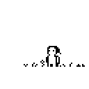
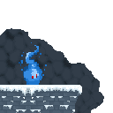

# Lilian Cornet

Étudiant en MMI (Métiers du Multimédia et de l'Internet) à l'IUT de Béziers.
Je travaille sur deux axes complémentaires : le **développement** — web front et
back, applications mobiles, systèmes bas niveau — et la **création visuelle** —
identité, interface, mise en page.

**Recherche une alternance ou un stage.** Ouvert aux projets en collaboration.

- Développement web : interfaces soignées, back PHP / Node, bases de données
- Applications : Android (Java / Capacitor), iOS (Swift / SwiftUI)
- Exploration bas niveau : noyau x86_64 en Rust
- Création : Illustrator, InDesign, Affinity Photo

 

## Contact

## Badges

Débloqués automatiquement selon mon activité réelle sur GitHub (heure des commits, jours particuliers, etc.) — via [my-badges](https://github.com/my-badges/my-badges), mis à jour chaque jour.

<!-- my-badges start -->

<!-- my-badges end -->

## Compétences

**Langages**

**Frameworks & outils**

**Suite Adobe**

## Projets

Tous mes dépôts publics, triés par dernière modification. Se met à jour tout seul (toutes les 6h) — voir [`projects.config.json`](projects.config.json).

 

<!-- PROJECTS:START -->
<!-- Généré automatiquement — voir projects.config.json -->

| Projet | Description | Stack | Commits | Branches | Maj |
|---|---|---|---|---|---|
| **[test](https://github.com/zaderlyl/test)** | _(pas encore de description)_ | `HTML` | 3 | 2 | 2026-09-17 |
| **[portfolio-v2](https://github.com/zaderlyl/portfolio-v2)** | Portfolio de Lilian Cornet — étudiant BUT MMI, développeur web et designer d'interfaces | `HTML` | 10 | 1 | 2026-09-15 |
| **[Note-2-](https://github.com/zaderlyl/Note-2-)** | Application de prise de notes partagées à deux en temps réel (Firebase), packagée en app Android avec Capacitor. Design inspiré du Nothing Phone. | `Java · Firebase` | 6 | 1 | 2026-09-14 |
| **[sans-couleurs](https://github.com/zaderlyl/sans-couleurs)** | Jeu de plateforme 2D pixel art (Phaser 3). Cartes, PNJ et dialogues définis dans Tiled plutôt que codés en dur. | `JavaScript · Phaser` | 38 | 5 | 2026-09-14 |
| **[pc-pet](https://github.com/zaderlyl/pc-pet)** | Compagnon flottant desktop (Asti / PC Pet) — moteur du compagnon de Nothing OS | `JavaScript` | 17 | 3 | 2026-09-14 |
| **[Nothing-OS](https://github.com/zaderlyl/Nothing-OS)** | Noyau x86_64 bare-metal écrit en Rust, bootable dans QEMU : système de fichiers persistant, pilotes ATA/PCI, partage de dossier hôte via virtio-9p, interface entièrement au clavier. | `Rust · ASM` | 86 | 5 | 2026-09-13 |
| **[Musee--FABI](https://github.com/Bebbou/Musee--FABI)** | Projet de groupe (SAÉ) : site d'un musée avec back PHP/MySQL et visite en 3D dans le navigateur (Three.js, modèles glTF). | `PHP · SQL · Three.js` · ★ 1 | 116 | 18 | 2026-06-19 |
| **[Spoti-Stat](https://github.com/zaderlyl/Spoti-Stat)** | Tableau de bord de statistiques d'écoute Spotify (API Spotify). | `JavaScript` | 38 | 1 | 2026-06-15 |
| **[WebGPU-test](https://github.com/zaderlyl/WebGPU-test)** | _(pas encore de description)_ | `HTML` | 4 | 1 | 2026-04-03 |
| **[PortfolioV1](https://github.com/zaderlyl/PortfolioV1)** | _(pas encore de description)_ | `CSS` | 53 | 1 | 2026-04-02 |
| **[SAE105](https://github.com/zaderlyl/SAE105)** | Site de visite virtuelle des Halles de Béziers : parcours 360° du marché couvert en A-Frame (WebVR), présentation des commerçants, pages À propos et contact. Projet SAÉ 105 — BUT MMI. HTML / CSS / JS. | `CSS` | 4 | 1 | 2026-03-09 |

<!-- PROJECTS:END -->
